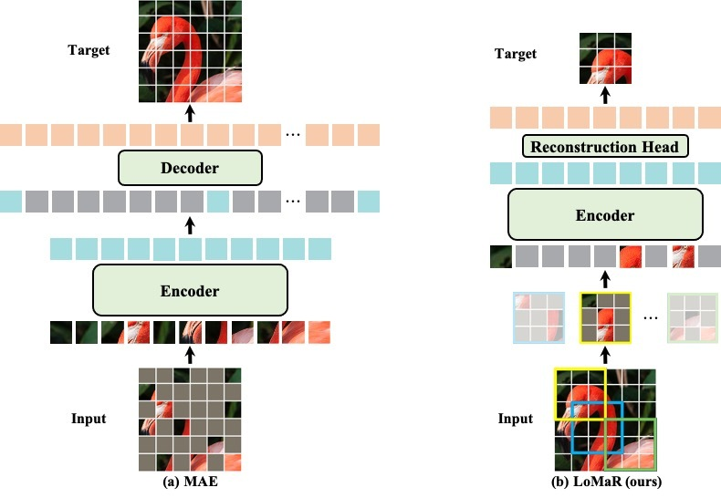

## LoMaR

<p align="center">
  
</p>


This is a PyTorch/GPU implementation of the paper [Efficient Self-supervised Vision Pretraining with Local Masked Reconstruction](https://arxiv.org/abs/2206.00790):


* This repo is a modification on the [MAE](https://github.com/facebookresearch/mae). Installation and preparation follow that repo.

* This repo is based on [`timm==0.3.2`](https://github.com/rwightman/pytorch-image-models), for which a [fix](https://github.com/rwightman/pytorch-image-models/issues/420#issuecomment-776459842) is needed to work with PyTorch 1.8.1+.

* The relative position encoding is modeled by following [iRPE](https://github.com/microsoft/Cream/tree/main/iRPE). To enable the iRPE with CUDA supported: 
```
cd rpe_ops/
python setup.py install --user
```


### Main Results on ImageNet-1K
<table><tbody>
<!-- START TABLE -->
<!-- TABLE HEADER -->
<th valign="bottom">Backbones</th>
<th valign="bottom">Method</th>
<th valign="bottom">Pretrain Epochs</th>
<th valign="bottom">Top-1 Acc</th>
<th valign="bottom">Pretrained Weights</th>
<th valign="bottom">Pretrain Logs</th>
<th valign="bottom">Finetune Logs</th>
<!-- TABLE BODY -->
<tr><td align="center">ViT/B-16</td>
<td align="center">LoMaR</td>
<td align="center">1600</td>
<td align="center">84.1</td>
<td align="center"><a href="https://drive.google.com/file/d/160kBTk95xOOCDVKPmxVADWtfqSMzRexW/view?usp=sharing">download</a></td>
<td align="center"><a href="https://drive.google.com/file/d/1OltaZ1JXVDqkYA72ZjbGRA1QzwAqktsU/view?usp=sharing">download</a></td>
<td align="center"><a href="https://drive.google.com/file/d/1in72Z5ZPcfYuKnfLcwkIjyBOXXPi4CE7/view?usp=sharing">download</a></td>
</tr>
</tbody></table>


### Pre-training
Pretrain the model:

```
python -m torch.distributed.launch --nproc_per_node=4 --nnodes=1 \
--master_addr=127.0.0.1 --master_port=29517 main_pretrain_lomar.py \
    --batch_size 256 \
    --accum_iter 4 \
    --output_dir ${LOG_DIR} \
    --log_dir ${LOG_DIR} \
    --model mae_vit_base_patch16 \
    --norm_pix_loss \
    --distributed \
    --epochs 400 \
    --warmup_epochs 20 \
    --blr 1.5e-4 --weight_decay 0.05 \
    --window_size 7 \
    --num_window 4 \
    --mask_ratio 0.8 \
    --data_path ${IMAGENET_DIR}
```

### Fine-tuning
Finetune the model:

```
python -m torch.distributed.launch --nproc_per_node=4 --nnodes=1 \
--master_addr=127.0.0.1 --master_port=29510 main_finetune_lomar.py \
    --batch_size 256 \
    --accum_iter 1 \
    --model vit_base_patch16 \
    --finetune ${PRETRAIN_CHKPT} \
    --epochs 100 \
    --log_dir ${LOG_DIR} \
    --blr 5e-4 --layer_decay 0.65 \
    --weight_decay 0.05 --drop_path 0.1 --reprob 0.25 --mixup 0.8 --cutmix 1.0 \
    --dist_eval --data_path ${IMAGENET_DIR}

```


### License

This project is under the CC-BY-NC 4.0 license. See [LICENSE](LICENSE) for details.


### Citation

```
@article{chen2022efficient,
  title={Efficient Self-supervised Vision Pretraining with Local Masked Reconstruction},
  author={Chen, Jun and Hu, Ming and Li, Boyang and Elhoseiny, Mohamed},
  journal={arXiv preprint arXiv:2206.00790},
  year={2022}
}
```